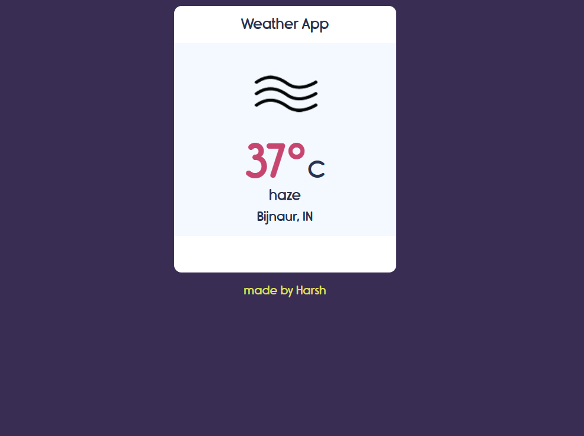

Hello!!
The weather App is built using HTML, CSS, Javascript.
 
 
Weather App Features
 
1. Weather app take latitude and longitude to get location.
2. Weather app use Openweathermap API, to get weather data.
3. Weather app Show temperature in default in Celsius and when clicked temperature show in Kelvin.

The API provider by http://www.OpenWeatherMap.org
Create your personal account in http://www.OpenWeatherMap.org, and get your API key in My API section.

